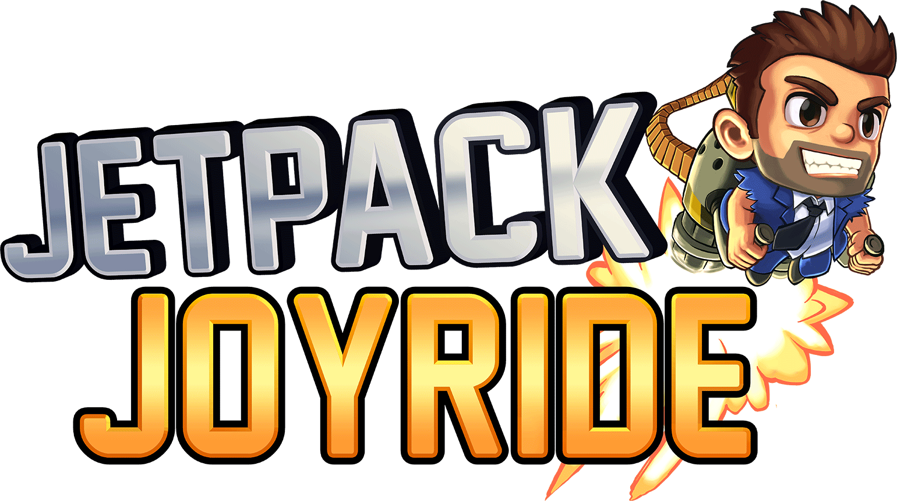

<div align="center">



</div>
<h1 align="center">Jetpack Joyride - Nintendo Switch port</h1>

This is a wrapper/port of the Android ARM64 version of Jetpack Joyride (`1.104.1`). <br/>
It loads the original game's ARM64 library and runs it as-is inside a minimal Android compatibility environment.

### How to install

You will need a legally obtained copy of Jetpack Joyride `1.104.1`.

Create `/switch/jetpackjoyride_nx/` on your SD card, copy `jetpackjoyride_nx.nro` there, then extract the complete contents of the APK into the directory.

```text
/switch/jetpackjoyride_nx/
  jetpackjoyride_nx.nro
  lib/
    arm64-v8a/
      libmortargame.so
  assets/
    assets.zip
```

On first boot, the port validates the game data, locates the required library and asset archive, moves them into place, and removes Android files that are not needed on Nintendo Switch.

### Notes

This will not work in applet/album mode. Use a game override (hold R while launching a title) or a forwarder so the game receives the full application memory pool and the required code-memory permissions.

### How to build

You need devkitA64 plus the following devkitPro packages:

* `switch-mesa`
* `switch-libdrm_nouveau`
* `switch-sdl2`
* `switch-zlib`

From an MSYS2 environment with devkitPro mounted at `/opt/devkitpro`:

```bash
./build.sh clean -j4
```

The resulting release build is `jetpackjoyride_nx.nro`.

### Credits

* TheOfficialFloW, Andy Nguyen, and fgsfds for the Android shared-object loader lineage
* devkitPro and libnx contributors for the Nintendo Switch homebrew toolchain
* Mesa and SDL contributors for graphics and audio support

### Support

If you enjoy my work and want to support me:

[](https://ko-fi.com/D1D1P2MOG)

### Legal

This project is not affiliated with Halfbrick Studios. Jetpack Joyride and all related assets are trademarks or property of their respective owners. All rights reserved.
No assets or program code from Jetpack Joyride are included in this repository. We do not condone piracy and encourage users to legally obtain the original game.
